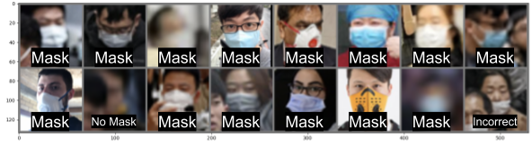

<!-- PROJECT SHIELDS -->
[![Contributors][contributors-shield]][contributors-url]
[![Forks][forks-shield]][forks-url]
[![Stargazers][stars-shield]][stars-url]
[![Issues][issues-shield]][issues-url]
[![MIT License][license-shield]][license-url]

<br />
<p align="center">
  <h1 align="center">Face Mask Detection</h1>

  <p align="center">
    A machine learning model for a <a href="http://cs229.stanford.edu">CS 229</a> final project
    <br />
    <a href="tex/report.pdf">Read the report »</strong></a>
    ·
    <a href="https://github.com/dastratakos/Face-Mask-Detection/issues">Request a feature »</a>
  </p>

  
</p>

<!-- TABLE OF CONTENTS -->
## Table of Contents

* [About the Project](#about-the-project)
* [Getting Started](#getting-started)
* [Usage](#usage)
* [License](#license)
* [Contact](#contact)

<!-- ABOUT THE PROJECT -->
## About The Project

Across the globe, there have been 55.6M million reported coronavirus cases (up from 33.8M last month). Covid-19 has plunged countless nations into chaos and recession as they scramble to keep the virus contained. Due to the highly contagious nature of the virus, every individual must do their part in preventing the spread by taking precautions such as wearing a face mask. Yet there are still many individuals who refuse to do so - this careless behavior puts many lives at risk, so it is imperative that we hold these individuals responsible.

In light of this issue, our project aims to create a machine learning model that can accurately detect, given an image, whether a person is properly wearing a face mask or not. This project will especially be important in the global return to work effort as businesses continue to search for ways to keep their employees and customers safe. Automating the process of face mask detection will reduce human labor while creating a system of accountability.

<!-- GETTING STARTED -->
## Getting Started

To get a local copy up and running follow these simple steps.

1. Clone the repo
```sh
git clone https://github.com/dastratakos/Face-Mask-Detection.git
```
2. Install packages
```sh
pip install -r requirements.txt
```

### Preprocessing the dataset

1. Download dataset from [Kaggle](https://www.kaggle.com/andrewmvd/face-mask-detection) into the `Face-Mask-Detection` directory.
2. Crop the images.
```sh
python data_preprocessing/crop.py
```
3. Balance the dataset
```sh
python data_preprocessing/balance.py
```

<!-- USAGE EXAMPLES -->
## Usage

1. Run the pipeline and pass in the model to run. For example:
```sh
python run_pipeline.py SVM
```
2. For ResNet models, it is recommended to use a VM through a platform such as GCP (Google Cloud Platform).

<!-- LICENSE -->
## License

Distributed under the Apache 2.0 License. See `LICENSE` for more information.

<!-- CONTACT -->
## Contact

Charles Pan, Gilbert Rosal, and Dean Stratakos -
[{cpan22, rosalg, dstratak}@stanford.edu](mailto:dstratak@stanford.edu,cpan22@stanford.edu,rosalg@stanford.edu)

Project Link: [https://github.com/dastratakos/Face-Mask-Detection](https://github.com/dastratakos/Face-Mask-Detection)

<!-- MARKDOWN LINKS & IMAGES -->
<!-- https://www.markdownguide.org/basic-syntax/#reference-style-links -->
[contributors-shield]: https://img.shields.io/github/contributors/dastratakos/Face-Mask-Detection.svg?style=flat-square
[contributors-url]: https://github.com/dastratakos/Face-Mask-Detection/graphs/contributors
[forks-shield]: https://img.shields.io/github/forks/dastratakos/Face-Mask-Detection.svg?style=flat-square
[forks-url]: https://github.com/dastratakos/Face-Mask-Detection/network/members
[stars-shield]: https://img.shields.io/github/stars/dastratakos/Face-Mask-Detection.svg?style=flat-square
[stars-url]: https://github.com/dastratakos/Face-Mask-Detection/stargazers
[issues-shield]: https://img.shields.io/github/issues/dastratakos/Face-Mask-Detection.svg?style=flat-square
[issues-url]: https://github.com/dastratakos/Face-Mask-Detection/issues
[license-shield]: https://img.shields.io/github/license/dastratakos/Face-Mask-Detection.svg?style=flat-square
[license-url]: https://github.com/dastratakos/Face-Mask-Detection/blob/master/LICENSE.txt
[linkedin-shield]: https://img.shields.io/badge/-LinkedIn-black.svg?style=flat-square&logo=linkedin&colorB=555
[linkedin-url]: https://linkedin.com/in/dean-stratakos-8b338b149
[product-screenshot]: images/screenshot.png
